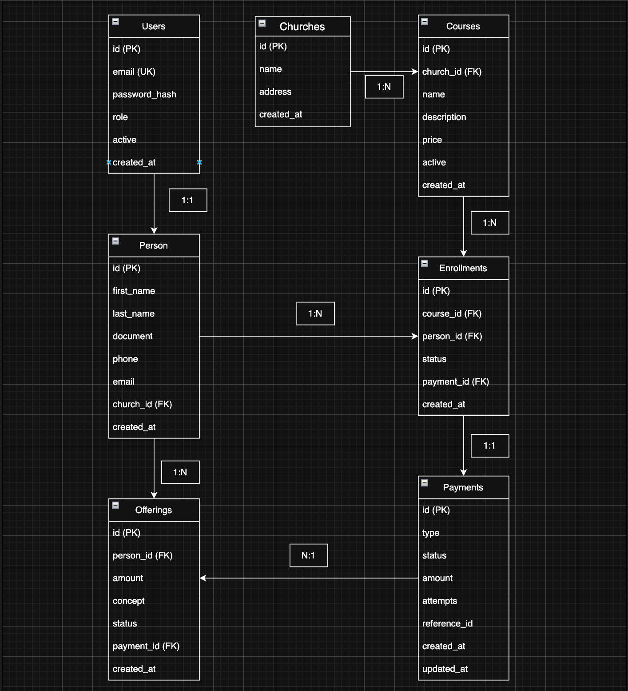

## Refactorización arquitectónica del ERP Iglesias aplicando principios SOLID y patrones de diseño

## Estado - Implementado 

# Contexto

## Stack Actual del Proyecto

El sistema ERP Iglesia está construido utilizando una arquitectura desacoplada con frontend y backend separados. A continuación se presenta el stack tecnológico actual utilizado en el desarrollo del sistema.

### Backend

| Tecnología | Versión | Descripción |
|---|---|---|
| Spring Boot | 3.2.3 | Framework principal para la construcción de la API REST |
| Java | 17 | Lenguaje de programación utilizado en el backend |
| Spring Data JPA (Hibernate) | - | ORM utilizado para la persistencia de datos |
| PostgreSQL | 16 | Sistema de gestión de base de datos relacional |
| Spring Security | - | Manejo de autenticación y autorización |
| JJWT | 0.11.5 | Implementación para generación y validación de tokens JWT |
| Maven | 3.9.6 | Herramienta de gestión de dependencias y build |
| Spring Boot Validation | - | Validación de datos en entidades y DTO |

### Frontend

| Tecnología | Versión | Descripción |
|---|---|---|
| Angular | 17.3.0 | Framework para el desarrollo de la aplicación web SPA |
| TypeScript | 5.4.2 | Lenguaje tipado utilizado en el frontend |
| Angular CLI | 17.3.17 | Herramienta para desarrollo y build del proyecto |
| Karma | - | Test runner para pruebas unitarias |
| Jasmine | - | Framework de testing |

### Infraestructura

| Tecnología | Descripción |
|---|---|
| Docker | Plataforma de contenedores utilizada para desplegar servicios |
| Docker Compose | Orquestación de contenedores del sistema |
| PostgreSQL Container | Base de datos ejecutándose dentro de contenedor |
| Node.js 20 Alpine | Entorno de construcción del frontend |
| Nginx | Servidor web para servir el frontend estático |

---

# Estructura de Carpetas

```text
erp_iglesias/
├── backend/
│   ├── src/main/java/com/iglesia/
│   │   ├── Controllers/ (8 REST controllers)
│   │   ├── Entities/ (8 JPA entities)
│   │   ├── Repositories/ (8 JpaRepository interfaces)
│   │   ├── Security/ (JWT + Security config)
│   │   └── Services/ (Auth + User details)
│   ├── src/main/resources/
│   │   └── application.properties
│   ├── Dockerfile
│   └── pom.xml
├── frontend/
│   ├── src/app/
│   │   ├── Components/ (9 components modularizados)
│   │   ├── Services/ (API + Auth)
│   │   ├── Guards/ (auth.guard.ts)
│   │   ├── Interceptors/ (auth.interceptor.ts)
│   │   └── Routes/ (app.routes.ts)
│   ├── Dockerfile
│   └── package.json
├── docker-compose.yml
└── ADR.md
```
## Hallazgos del diagnóstico

Aspectos positivos

- Arquitectura desacoplada: Existe una clara distinción entre el front-end y el back-end.
- Contenedorización del sistema: Se utilizan Docker y Docker Compose para la implementación del sistema.
- Autenticación implementada: Se utilizan tokens web JSON en este sistema.
- Modularidad del front-end: Existe una clara organización de componentes en Angular.
- API REST estructurada: Todos los endpoints tienen el formato estandarizado /api/{resource}.
- Configuración de pruebas: Karma y Jasmine están configurados para las pruebas del front-end.

Áreas de mejora

- Estructura monolítica del back-end: La mayoría de las clases se encuentran en el paquete com.iglesia.
- Uso implícito de repositorios: Falta la anotación @Repository explícita en las interfaces JpaRepository.
- Ausencia de capa de servicios empresariales: Algunos controladores acceden directamente a los repositorios. - Configuración confidencial codificada: El secreto JWT está codificado en la aplicación.
- Sin pruebas unitarias: Aunque las herramientas están configuradas, no hay pruebas de backend.
- Validación limitada: Solo se utiliza la validación básica de Spring Boot.


## Diagrama MER



## Decisiones

| # | Decisión | Patrón / Principio | Dónde se Aplica | Mejora Arquitectónica |
|---|---|---|---|---|
| 1 | Arquitectura Hexagonal | Hexagonal Architecture + DIP | Estructura del proyecto en `domain/`, `application/`, `infrastructure/` | Permite separar la lógica de negocio del resto del sistema como la base de datos o el framework. Esto reduce el acoplamiento y hace que el sistema sea más fácil de mantener y probar. |
| 2 | Service Layer | Service Layer + SRP | `application/service/` con clases como `PersonService`, `PaymentService` | Los controladores solo se encargan de manejar las peticiones HTTP y la lógica de negocio se mueve a los servicios. Esto hace el código más organizado y facilita reutilizar la lógica en diferentes partes del sistema. |
| 3 | Repository Pattern | Repository + ISP | `domain/repository/` (interfaces) y `infrastructure/persistence/` (implementaciones) | Permite separar el acceso a datos de la lógica del dominio. De esta forma, si cambia la tecnología de base de datos, el dominio no se ve afectado y el código se vuelve más flexible. |
| 4 | DTO Pattern | DTO + Separation of Concerns | `application/dto/` con `PersonDTO`, `PaymentDTO`, `ChurchDTO` | Los DTO permiten controlar qué datos se envían entre el backend y el frontend. Esto evita exponer directamente las entidades del dominio y mejora la seguridad y organización del código. |
| 5 | Strategy Pattern | Strategy + OCP | `domain/service/payment/` con `PaymentStrategy`, `CashPaymentStrategy`, `CardPaymentStrategy` | Permite manejar diferentes tipos de pago usando clases separadas. Así se evita usar muchos `if` o `switch` y se pueden agregar nuevos métodos de pago sin modificar el código existente. |
| 6 | Observer Pattern | Observer + DIP | `domain/event/` con `DomainEventPublisher`, `PaymentObserver`, `EnrollmentObserver` | Permite que diferentes partes del sistema reaccionen a eventos sin estar directamente conectadas. Esto reduce el acoplamiento y facilita agregar nuevas funcionalidades como notificaciones o auditoría. |
| 7 | Factory Pattern | Factory Method + SRP | `domain/factory/` con `PersonFactory`, `PaymentFactory`, `EnrollmentFactory` | Centraliza la creación de objetos del dominio. Esto ayuda a mantener la lógica de creación en un solo lugar y evita constructores muy complejos en las entidades. |
| 8 | Decorator Pattern | Decorator + OCP | `infrastructure/decorator/` con `CachingServiceDecorator`, `LoggingServiceDecorator` | Permite agregar funcionalidades como logging o caché sin modificar la clase original del servicio. Esto mejora la extensibilidad del sistema y mantiene el código limpio. |
| 9 | Dependency Injection | DI + DIP | Configuración Spring con `@Service`, `@Repository`, `@Component` | Permite que las dependencias se inyecten automáticamente en lugar de crearlas manualmente. Esto reduce el acoplamiento entre clases y facilita las pruebas del sistema. |
| 10 | Domain Events | Domain Events + Observer | `domain/event/` con `PersonCreatedEvent`, `PaymentProcessedEvent`, `EnrollmentCompletedEvent` | Esto permite representar eventos importantes del sistema y facilita la reacción del sistema ante ellos por parte de otros módulos. Este mecanismo ayuda a desacoplar las funcionalidades del sistema.|

## Cambios implementados

# 📋 Documentación Completa de los 5 Patrones Arquitectónicos

## 1. Service Layer Pattern

### Archivo/Clase Modificado:
- **Nuevo**: `/backend/src/main/java/com/iglesia/Service/PersonService.java`
- **Nuevo**: `/backend/src/main/java/com/iglesia/Service/PaymentService.java`
- **Modificado**: `PersonController.java` (ahora usa servicio)

### Antes (PersonController.java):
```java
@RestController
@RequestMapping("/api/people")
public class PersonController {
    private final PersonRepository personRepository;
    private final ChurchRepository churchRepository;
 
    @PostMapping
    public PersonResponse create(@RequestBody PersonRequest request) {
        Church church = requireChurch();
        Person person = new Person();
        person.setFirstName(request.firstName());
        person.setLastName(request.lastName());
        person.setDocument(request.document());
        person.setPhone(request.phone());
        person.setEmail(request.email());
        person.setChurch(church);
        personRepository.save(person);
        return PersonResponse.from(person);
    }
 
    @GetMapping
    public List<PersonResponse> list() {
        Church church = requireChurch();
        return personRepository.findAllByChurchId(church.getId())
            .stream()
            .map(PersonResponse::from)
            .toList();
    }
}
```

### Después (PersonService.java):
```java
@Service
@Transactional
public class PersonService {
    private final PersonRepository personRepository;
    private final ChurchRepository churchRepository;
    private final DomainEventPublisher eventPublisher;
 
    public PersonService(PersonRepository personRepository, 
                        ChurchRepository churchRepository,
                        DomainEventPublisher eventPublisher) {
        this.personRepository = personRepository;
        this.churchRepository = churchRepository;
        this.eventPublisher = eventPublisher;
    }
 
    public PersonDTO createPerson(String firstName, String lastName, String document, String phone, String email) {
        Church church = getDefaultChurch();
        Person person = new Person();
        person.setFirstName(firstName);
        person.setLastName(lastName);
        person.setDocument(document);
        person.setPhone(phone);
        person.setEmail(email);
        person.setChurch(church);
        
        Person savedPerson = personRepository.save(person);
        
        // Publicar evento de dominio
        eventPublisher.publishPersonCreated(savedPerson);
        
        return PersonDTO.from(savedPerson);
    }
 
    @Transactional(readOnly = true)
    public List<PersonDTO> getAllPeople() {
        Church church = getDefaultChurch();
        return personRepository.findAllByChurchId(church.getId())
            .stream()
            .map(PersonDTO::from)
            .toList();
    }
}

---

## 2. Repository Pattern

### Archivo/Clase Modificado:
- **Existente**: `PersonRepository.java` (JPA directo)
- **Existente**: `PaymentRepository.java` (JPA directo)
- **Existente**: `ChurchRepository.java` (JPA directo)

### Antes:
No existía separación clara entre dominio y persistencia.

### Después:
```java
// Interfaces existentes (sin cambios)
public interface PersonRepository extends JpaRepository<Person, Long> {
    List<Person> findAllByChurchId(Long churchId);
}
 
// Uso en servicios (inyección de dependencia)
@Service
public class PersonService {
    private final PersonRepository personRepository; // ✅ Inyección limpia
    
    public List<PersonDTO> getAllPeople() {
        return personRepository.findAllByChurchId(church.getId()) // ✅ Uso directo
            .stream()
            .map(PersonDTO::from)
            .toList();
    }
}
```

---

## 3. DTO Pattern

### Archivo/Clase Modificado:
- **Nuevo**: `/backend/src/main/java/com/iglesia/dto/PersonDTO.java`
- **Nuevo**: `/backend/src/main/java/com/iglesia/dto/PaymentDTO.java`
- **Nuevo**: `/backend/src/main/java/com/iglesia/dto/ChurchDTO.java`

### Antes (PersonController.java):
```java
public record PersonResponse(
    Long id,
    String firstName,
    String lastName,
    String document,
    String phone,
    String email
) {
    public static PersonResponse from(Person person) {
        return new PersonResponse(
            person.getId(),
            person.getFirstName(),
            person.getLastName(),
            person.getDocument(),
            person.getPhone(),
            person.getEmail()
        );
    }
}
```

### Después (/dto/PersonDTO.java):
```java
package com.iglesia.dto;
 
import jakarta.validation.constraints.NotBlank;
 
public record PersonDTO(
    Long id,
    @NotBlank String firstName,     // ✅ Validaciones
    @NotBlank String lastName,     // ✅ Validaciones
    String document,
    String phone,
    String email
) {
    public static PersonDTO from(com.iglesia.Person person) {
        return new PersonDTO(
            person.getId(),
            person.getFirstName(),
            person.getLastName(),
            person.getDocument(),
            person.getPhone(),
            person.getEmail()
        );
    }
}
```

---

## 4. Strategy Pattern

### Archivo/Clase Modificado:
- **Nuevo**: `/backend/src/main/java/com/iglesia/strategy/PaymentStrategy.java`
- **Nuevo**: `/backend/src/main/java/com/iglesia/strategy/CoursePaymentStrategy.java`
- **Nuevo**: `/backend/src/main/java/com/iglesia/strategy/OfferingPaymentStrategy.java`
- **Nuevo**: `/backend/src/main/java/com/iglesia/strategy/PaymentStrategyFactory.java`

### Antes (PaymentController.java):
```java
@PostMapping("/{id}/confirm")
public PaymentResponse confirm(@PathVariable Long id) {
    Payment payment = paymentRepository.findById(id).orElseThrow(/*...*/);
    payment.setStatus(PaymentStatus.CONFIRMADO);
    paymentRepository.save(payment);
 
    // ❌ if/else chain - difícil de mantener
    if (payment.getType() == PaymentType.INSCRIPCION_CURSO) {
        Enrollment enrollment = enrollmentRepository.findById(/*...*/);
        enrollment.setStatus(EnrollmentStatus.PAGADA);
        enrollmentRepository.save(enrollment);
    } else if (payment.getType() == PaymentType.OFRENDA) {
        Offering offering = offeringRepository.findById(/*...*/);
        offering.setStatus(OfferingStatus.REGISTRADA);
        offeringRepository.save(offering);
    }
    return PaymentResponse.from(payment);
}
```

### Después:
```java
// Interface Strategy
public interface PaymentStrategy {
    PaymentDTO process(Payment payment);
    boolean supports(PaymentType type);
}
 
// Estrategia específica
@Component
public class CoursePaymentStrategy implements PaymentStrategy {
    private final EnrollmentRepository enrollmentRepository;
    
    @Override
    public PaymentDTO process(Payment payment) {
        payment.setStatus(PaymentStatus.CONFIRMADO);
        Enrollment enrollment = enrollmentRepository.findById(payment.getReferenceId())
            .orElseThrow(() -> new RuntimeException("Inscripción no encontrada"));
        enrollment.setStatus(EnrollmentStatus.PAGADA);
        enrollmentRepository.save(enrollment);
        return PaymentDTO.from(payment);
    }
    
    @Override
    public boolean supports(PaymentType type) {
        return type == PaymentType.INSCRIPCION_CURSO;
    }
}
 
// Factory
@Component
public class PaymentStrategyFactory {
    private final List<PaymentStrategy> strategies;
 
    public PaymentStrategyFactory(List<PaymentStrategy> strategies) {
        this.strategies = strategies;
    }
 
    public PaymentStrategy getStrategy(PaymentType type) {
        return strategies.stream()
            .filter(strategy -> strategy.supports(type))
            .findFirst()
            .orElseThrow(() -> new RuntimeException("No strategy found for payment type: " + type));
    }
}
 
// Uso en servicio
@Service
public class PaymentService {
    private final PaymentStrategyFactory strategyFactory;
    
    public PaymentDTO confirmPayment(Long id) {
        Payment payment = findPayment(id);
        // ✅ Sin if/else - estrategia seleccionada automáticamente
        PaymentDTO result = strategyFactory.getStrategy(payment.getType()).process(payment);
        paymentRepository.save(payment);
        return result;
    }
}
```

---

## 5. Domain Events

### Archivo/Clase Modificado:
- **Nuevo**: `/backend/src/main/java/com/iglesia/event/PersonCreatedEvent.java`
- **Nuevo**: `/backend/src/main/java/com/iglesia/event/PaymentProcessedEvent.java`
- **Nuevo**: `/backend/src/main/java/com/iglesia/event/DomainEventPublisher.java`

### Antes:
No existía sistema de eventos, las operaciones eran síncronas sin auditoría.

### Después:
```java
// Evento de dominio
public class PersonCreatedEvent {
    private final Long personId;
    private final String firstName;
    private final String lastName;
    private final LocalDateTime createdAt;
    
    public PersonCreatedEvent(Long personId, String firstName, String lastName) {
        this.personId = personId;
        this.firstName = firstName;
        this.lastName = lastName;
        this.createdAt = LocalDateTime.now();
    }
    
    // Getters...
}
 
// Publicador de eventos
@Component
public class DomainEventPublisher {
    private final ApplicationEventPublisher eventPublisher;
 
    public DomainEventPublisher(ApplicationEventPublisher eventPublisher) {
        this.eventPublisher = eventPublisher;
    }
 
    public void publishPersonCreated(Person person) {
        PersonCreatedEvent event = new PersonCreatedEvent(
            person.getId(), person.getFirstName(), person.getLastName()
        );
        eventPublisher.publishEvent(event); // ✅ Evento publicado
    }
    
    public void publishPaymentProcessed(Payment payment) {
        PaymentProcessedEvent event = new PaymentProcessedEvent(
            payment.getId(), payment.getType(), payment.getAmount(), payment.getStatus()
        );
        eventPublisher.publishEvent(event);
    }
}
 
// Uso en servicios
@Service
public class PersonService {
    private final DomainEventPublisher eventPublisher;
    
    public PersonDTO createPerson(/*...*/) {
        // ... lógica de creación
        Person savedPerson = personRepository.save(person);
        
        // ✅ Publicar evento para auditoría/notificaciones
        eventPublisher.publishPersonCreated(savedPerson);
        
        return PersonDTO.from(savedPerson);
    }
}
```

## 🎯 Resumen de Beneficios Arquitectónicos

### 1. **Service Layer Pattern**
- ✅ **Separación de responsabilidades**: Controladores solo manejan HTTP
- ✅ **Reutilización**: Lógica de negocio reutilizable
- ✅ **Testing**: Más fácil de probar la lógica de negocio

### 2. **Repository Pattern**
- ✅ **Abstracción**: Separación entre dominio y persistencia
- ✅ **Flexibilidad**: Cambio de base de datos sin afectar el dominio
- ✅ **Testabilidad**: Fácil de mockear para pruebas

### 3. **DTO Pattern**
- ✅ **Seguridad**: Control sobre datos expuestos
- ✅ **Validación**: Validaciones en capa de presentación
- ✅ **Contrato claro**: API bien definida

### 4. **Strategy Pattern**
- ✅ **Extensibilidad**: Nuevas estrategias sin modificar código
- ✅ **Mantenibilidad**: Eliminación de if/else chains
- ✅ **SOLID**: Cumple con Open/Closed Principle

### 5. **Domain Events**
- ✅ **Desacoplamiento**: Componentes reaccionan sin estar conectados
- ✅ **Auditoría**: Registro automático de eventos
- ✅ **Extensibilidad**: Nuevos listeners sin modificar código existente

---

## Consecuencias 

### Impacto Positivo

#### 🎯 **Mejor Calidad del Código**
- **Clara Separación de Responsabilidades**: Cada componente tiene su función específica
- **Código Más Mantenible**: Los patrones facilitan la comprensión y modificación del código
- **Reducción de Duplicaciones**: El código que contiene la lógica de negocio se centraliza en la capa de servicio
- **Mejor Capacidad de Prueba**: Los componentes están desacoplados, por lo que son fácilmente testeables

#### 🚀 **Escalabilidad y Extensibilidad**
- **Fácil Incorporación de Nuevas Características**: Los patrones permiten la extensión del código sin afectar el código existente
- **Estrategias de Pago Extensibles**: La introducción de un nuevo tipo de pago requiere la creación de una nueva estrategia
- **Eventos Desacoplados**: Se pueden agregar nuevos oyentes fácilmente sin afectar el código existente
- **DTO Flexibles**: La respuesta de la API se puede extender fácilmente sin afectar la capa de dominio

#### 🔒 **Seguridad y Validación**
- **Validaciones Centralizadas**: Los DTO contienen la validación en la capa de presentación
- **Control de datos expuestos**: Los DTO se utilizan para controlar la cantidad de datos expuestos al frontend
- **Auditoría automática**: Los eventos de dominio se utilizan para auditar la aplicación

#### 📊 **Rendimiento y Optimización**
- **Transacciones optimizadas**: La capa de servicio gestiona las transacciones eficientemente
- **Consultas optimizadas**: La capa de repositorio permite consultas específicas del dominio
- **Caché y registro**: Los patrones facilitan la incorporación de estas optimizaciones

### Ventajas y Consideraciones

#### ⚖️ **Complejidad Arquitectónica**
- **Curva de aprendizaje**: Los nuevos miembros del equipo deberán comprender los patrones implementados
- **Mayor número de clases**: Más archivos debido a la separación de responsabilidades
- **Indirección adicional**: Una mayor indirección puede dificultar el seguimiento de la ejecución Flujo

#### 🏗️ **Insumos de desarrollo**
- **Tiempo de desarrollo inicial**: Se requiere más tiempo para la implementación de los patrones
- **Código repetitivo**: Se requiere más código para la implementación de los patrones (interfaces, fábricas)
- **Mantenimiento multicapa**: Se requiere más tiempo para el mantenimiento del código

#### 🔧 **Consideraciones de rendimiento**
- **Latencia adicional**: Una mayor indirección puede resultar en una ligera pérdida de rendimiento
- **Consumo de memoria**: Más objetos en memoria debido a la separación de responsabilidades
- **Complejidad de depuración**: Una mayor indirección puede complicar la depuración

#### 📋 **Gestión de cambios**
- **Impacto de los cambios de dominio**: Los cambios en el dominio pueden afectar a más de una capa
- **Evolución del DTO**: Los cambios en el DTO pueden afectar a más de una capa
- **Mantenimiento de la estrategia**: Los nuevos tipos de negocio requieren la implementación de nuevas estrategias
